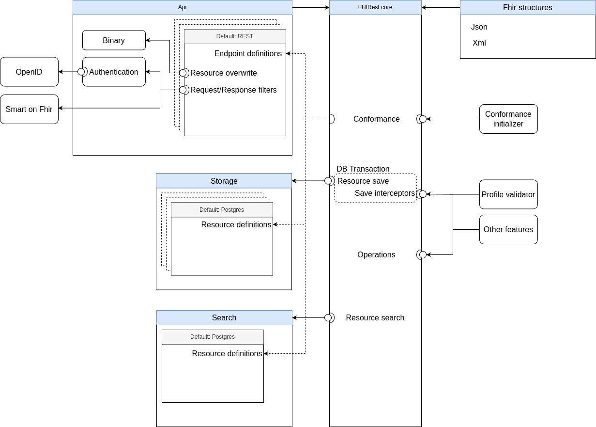

FHIRest (pronounced as “firest”) is framework to adapt FHIR standard as easy and standardized way as possible. It has proven to be a stable and reliable. Different FHIR-based NHS (National Health Services) components for different regions and countries have been developed on top of FHIRest, such as MPI (Master Patient Index), e-prescription, Data Aggregator, Terminology server and HIS solutions. FHIRest is planned to support wide set of [IHE FHIR related profiles](https://wiki.ihe.net/index.php/Category:FHIR) and EU eHealth Data Space defined functional profiles.

Much more than a generic FHIR Server. Built to adapt your enterprise to any use case!

Simple demo FHIR server built on top of framework: https://fhirest.fhir.ee/fhir

# Key characteristics of FHIRest framework 
- FHIRest is a framework for building HL7 FHIR applications or adopting FHIR standard to your existing solution.
- FHIRest gives full freedom on customization on all layers.
- FHIRest base functionality of FHIR standard can be configured by providing Conformance resources.
- FHIRest supports several implementations for data storage. The default implementation is based on PostgreSQL.
- FHIRest provides profile validators and allows to create own validators.
- FHIRest allows implementing any authentication, provides out-of-the-box simple implementation of OpenID-Connect
- FHIRest is horizontally and vertically scalable.
- FHIRest is great for microservices architecture.
- FHIRest is open-source software available on GitHub under an MIT license.

You can access community by e-mail fhirest@tehik.ee or chat https://chat.fhir.org/#narrow/stream/454254-FHIRest  
Main repository is [https://github.com/fhirest/fhirest](https://github.com/fhirest/fhirest). If you want to contribute, please read [contribution guidelines](../CONTRIBUTING.md).

# Architecture of FHIRest framework

